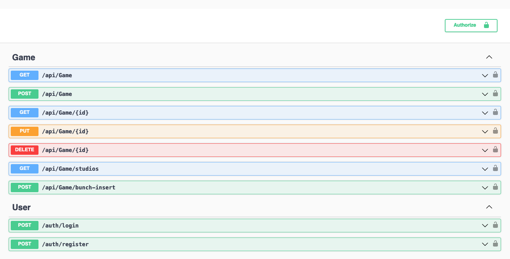

# GG Fullstack assessment

## Overview
This project is a full-stack application with a robust backend and an intuitive frontend. It includes several key features such as Swagger documentation, pagination, bulk data insertion, and simple authentication and authorization mechanisms. The project is containerized using Docker for easy setup and deployment.


This project was created as part of a job assessment to demonstrate my skills and potential. Due to time constraints, there may be some minor issues, but it successfully provides the requested functionality.

## Table of Contents
- [Features](#features)
- [Prerequisites](#prerequisites)
- [Installation](#installation)
- [Initial Data](#initial-data)
- [Authentication](#authentication)
- [Access URLs](#access-urls)
- [Screenshots](#screenshots)

## Features
- **Backend and Frontend**: Comprehensive backend with a user-friendly frontend.
- **Swagger Documentation**: API documentation available via Swagger.
- **Easy Setup**: Simple build and run using Docker Compose.
- **Initial Data**: Preloaded with initial data for testing and development.
- **Pagination**: Supports data pagination.
- **Bulk Insert**: Efficiently insert large amounts of data. (json file, like the sample file)
- **Authentication and Authorization**: Basic user authentication and role-based access control.

## Prerequisites
- **Docker**: Ensure Docker is installed on your machine.
- **Docker Compose**: Ensure Docker Compose is installed.

***Simple Way***: installing [docker desktop](https://docs.docker.com/desktop/)

## Installation
1. Clone the repository:
    ```sh
    git clone https://github.com/ttrasn/GGCsharp.git
    cd GGCsharp
    ```

2. Build and start the containers:
    ```sh
    docker-compose up
    ```

## Initial Data
The application comes with initial data to get you started quickly. This data is automatically loaded when you first run the application.

## Authentication
The application includes basic authentication and authorization. By default, an admin user is created with the following credentials:

- **Email**: `ttrasn@gmail.com`
- **Password**: `123456`

You can use these credentials to log in and access admin functionalities.

## Access URLs
Once the application is running, you can access it through the following URLs:

- **Frontend**: [http://localhost:5024](http://localhost:5024)
- **Backend API**: [http://localhost:5023](http://localhost:5023)
- **Swagger Documentation**: [http://localhost:5023/index.html](http://localhost:5023/index.html)

## Screenshots


